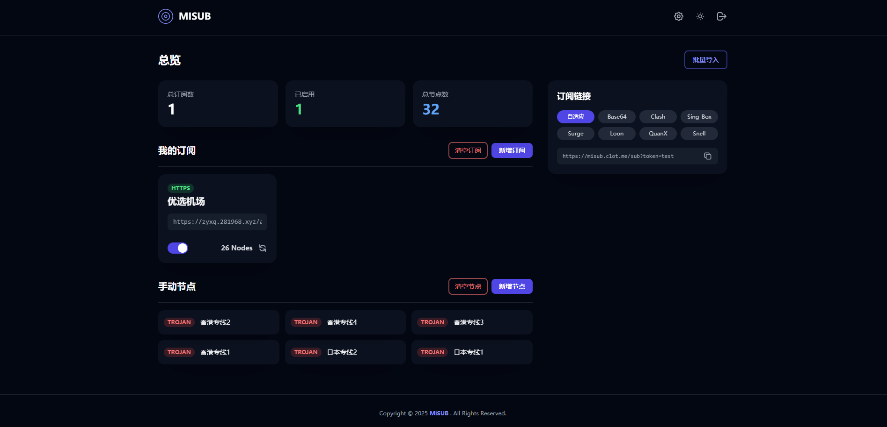

# MiSub

一个完全靠AI生成的订阅转换器。

### 致谢
本项目的是用CM大佬的项目 [CF-Workers-SUB](https://github.com/cmliu/CF-Workers-SUB) 丢给AI进化而来，感谢CM大佬。

MiSub 应用截图

---

### ✨ 主要功能

MiSub 不仅仅是一个简单的订阅转换工具，它经过了深度的架构优化和体验打磨，具备以下核心功能：

* **订阅与节点分离管理**: 业内首创（可能）将“机场订阅”和“手动单节点”作为两种不同实体进行独立管理，逻辑清晰，互不干扰。
* **强大的订阅生成**:
    * **自适应链接**: 一条链接，可智能识别客户端类型 (Clash, Surge 等) 并下发对应配置。
    * **专属客户端链接**: 为 Clash, Sing-Box, Surge, Loon, QuanX, Snell 等主流客户端提供专属格式的订阅链接。
    * **Base64 格式**: 支持为 V2RayN/V2RayNG 等客户端生成 Base64 编码的节点列表。
* **智能批量导入**: 一键粘贴多个订阅链接或节点链接，系统会自动分类，分别存入“订阅”和“手动节点”列表。
* **在线配置与持久化**: 所有订阅和节点数据、以及自定义设置（如输出文件名、`subconverter` 地址等）都通过 Cloudflare KV 在线持久化存储。
* **精致的 UI/UX**:
    * 支持明亮/暗黑模式，并能跟随系统自动切换。
    * 带有“磨砂玻璃”质感的现代化卡片设计，风格统一。
    * 对长列表（订阅和手动节点）提供分页功能，保证大量数据下的性能和可用性。
    * 完善的交互逻辑，如“放弃更改”、模态框编辑、加载状态提示等。
* **密码保护**: 管理界面由管理员密码进行保护。

### 🚀 技术栈

* **前端**: Vue 3 + Vite + Tailwind CSS
* **后端**: Cloudflare Pages Functions
* **数据存储**: Cloudflare KV

### 🛠️ 部署指南

本项目天生为 Cloudflare Pages 设计，可以一键部署。

#### 1. Fork 本仓库
将此项目 Fork 到你自己的 GitHub 账户下。

#### 2. 创建 Cloudflare Pages 项目
* 登录 Cloudflare 控制台，进入 `Pages`。
* 选择“创建项目” -> “连接到 Git”。
* 选择你刚刚 Fork 的仓库。
* 在 **“设置构建和部署”** 页面，构建设置如下:
    * **框架预设**: `Vite`
    * **构建命令**: `npm run build`
    * **构建输出目录**: `dist`

#### 3. 绑定 KV 命名空间
在项目创建完成后，进入该项目的“设置” -> “函数” -> “KV 命名空间绑定”。
* 点击“添加绑定”。
* **变量名称 (Variable name)**: `MISUB_KV`
* **KV 命名空间 (KV namespace)**: 选择或创建一个你自己的 KV 命名空间。

#### 4. 设置环境变量
在项目的“设置” -> “环境变量”中，添加以下两个**生产环境**变量：
* `ADMIN_PASSWORD`
    * **值**: 设置一个你自己的管理员登录密码。
* `COOKIE_SECRET`
    * **值**: 设置一个用于加密 Cookie 的、足够长且随机的字符串（例如，你可以使用密码生成器生成一个64位的随机字符串）。

#### 5. 部署！
完成以上设置后，回到“部署”选项卡，重新部署一次你的项目。现在，你的 MiSub 就可以通过 Cloudflare 提供的域名访问了！

### License
[MIT](./LICENSE)