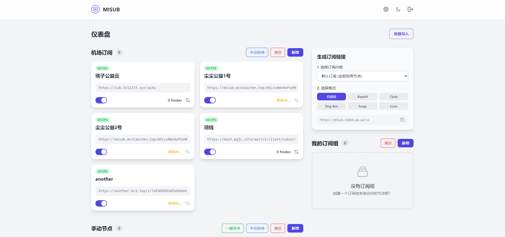
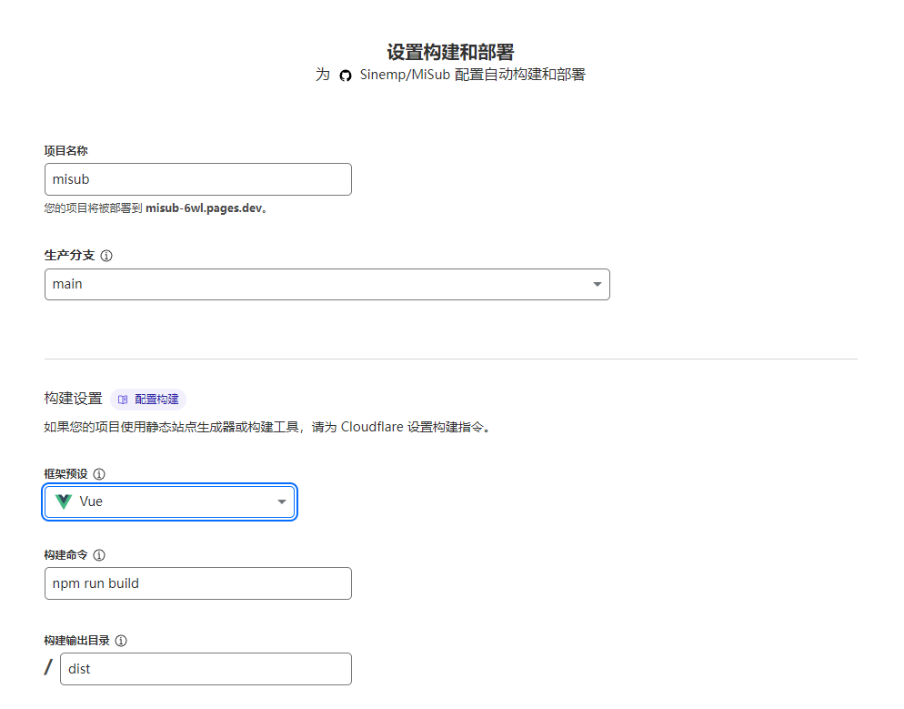
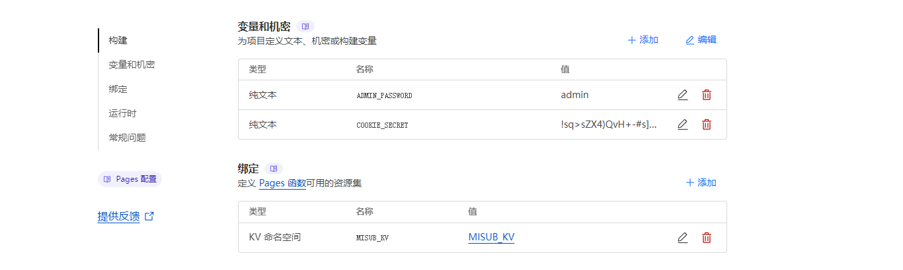

# MiSub

一个完全靠AI生成的订阅转换器。

# 🎉 最新更新：D1 数据库支持 - 彻底解决写入限制问题！

**新增 Cloudflare D1 数据库支持**，彻底解决 KV 存储的写入频率限制问题！现在您可以：
* ✅ **无限制写入**：D1 数据库没有 KV 的写入频率限制
* ✅ **一键迁移**：内置数据迁移工具，从 KV 无缝迁移到 D1
* ✅ **智能选择**：在设置中自由选择 KV 或 D1 存储方式
* ✅ **向后兼容**：现有 KV 数据完全不受影响

# 重大更新：强大的订阅分组功能与全新 UI 强势来袭！

* **增加了强大的订阅分组 (Profiles) 功能**，您可以自由组合机场订阅和手动节点，为不同场景生成专属订阅链接。
* **管理介面全面革新**，采用更直观、更高效的三栏式布局，管理大量订阅和节点也毫不费力。
* **后端资料结构已变更**，请所有从旧版本升级的朋友，务必**执行一次资料迁移**，否则无法使用！

### ⚠️ **老使用者升级必读**

为了支援新功能，我们重构了后端资料结构。升级后，请务必在您的网站登入后，**手动访问一次 `https://<您的域名>/api/migrate`** 来完成资料迁移。看到成功讯息即代表迁移完成！

***

### 致谢

本项目的是用CM大佬的项目[CF-Workers-SUB](https://github.com/cmliu/CF-Workers-SUB)丢给AI进化而来，感谢CM大佬。

### MiSub 应用截图




---

### ✨ 主要功能

MiSub 不仅仅是一个简单的订阅转换工具，它经过了深度的架构优化和体验打磨，具备以下核心功能：

* **强大的订阅分组 (Profiles)**
  * **自由组合**: 您可以建立任意数量的订阅组，例如「家庭共享」、「影音串流」、「游戏专用」等。
  * **精准控制**: 每个组可以自由勾选包含哪些「机场订阅」和「手动节点」。
  * **专属连结**: 每个订阅组都会生成一条独立的订阅连结，档名也会自动使用您的分组名称，分享和管理都极为清晰方便。
  * **全选/全不选**: 在编辑分组时，可以一键选择或取消选择所有订阅和节点，操作便捷。
* **订阅与节点分离管理**
  * 我们将可线上更新的「机场订阅」和您手动新增的「单个节点」作为两种不同实体进行独立管理，逻辑清晰，互不干扰。
* **智慧化的管理体验**
  * **批量汇入**: 一键贴上多个订阅连结或节点连结，系统会自动分类，分别存入「订阅」和「手动节点」列表。
  * **一键排序**: 对大量手动节点感到头痛？一键即可按照地区（如 HK, TW, SG, US 等）自动排序。
  * **手动拖曳排序**: 无论是机场订阅还是手动节点，都可以直接拖曳排序，调整其在最终订阅档中的顺序。
  * **流量与到期时间显示**: 在订阅卡片上清晰地显示机场的已用/总流量以及订阅到期时间，并以不同颜色高亮提醒。
  * **自动获取节点资讯**: 新增订阅或节点时，系统会自动从连结中提取名称。
* **精致的 UI/UX**
  * 支援明亮/暗黑模式，并能跟随系统自动切换。
  * 带有「磨砂玻璃」质感的现代化卡片设计，风格统一。
  * 对长列表（订阅和手动节点）提供分页功能，保证大量资料下的性能和可用性。
  * 完善的交互逻辑，如“您有未保存的变更”提示、“放弃更改”功能、模态框编辑、以及各种操作的载入状态提示，体验流畅。
* **强大且易用的订阅连结生成**
  * **一个面板，满足所有需求**: 在右侧的「生成订阅连结」面板中，您可以一步完成“选择内容（分组或全部）”和“选择格式”。
  * **自适应连结**: 提供一条通用连结，可智慧识别客户端类型 (Clash, Sing-Box 等) 并下发对应配置。
  * **多格式支援**: 为 Clash, Sing-Box, Surge, Loon, Base64 等主流客户端和格式提供专属订阅连结。
* **安全与客製化**
  * **密码保护**: 管理介面由您自订的管理员密码进行保护。
  * **高度可客製化**: 在设定中，您可以自订输出档名、`subconverter` 位址、TG 推播等多种选项。
  * **双重存储支持**: 支持 Cloudflare KV 和 D1 数据库两种存储方式，可根据需求自由选择。
* **🆕 D1 数据库支持**
  * **解决写入限制**: D1 数据库没有 KV 的写入频率限制，适合频繁更新的场景。
  * **一键数据迁移**: 内置迁移工具，可将现有 KV 数据无缝迁移到 D1。
  * **智能存储选择**: 在设置中可以选择使用 KV 存储（默认）或 D1 数据库。
  * **性能优化**: 针对不同存储类型进行了专门优化，确保最佳性能。

### 🚀 技术栈

* **前端**: Vue 3 + Vite + Tailwind CSS
* **后端**: Cloudflare Pages Functions
* **资料储存**: Cloudflare KV + D1 数据库（双重支持）

### 🛠️ 部署指南

本项目天生为 Cloudflare Pages 设计，可以一键部署。

#### 1. Fork 本仓库

将此项目 Fork 到你自己的 GitHub 账户下。

#### 2. 创建 Cloudflare Pages 项目

* 登录 Cloudflare 控制台，进入 `Workers & Pages`。
* 选择“创建应用程式” -> “Pages” -> “连结到 Git”。
* 选择你刚刚 Fork 的仓库。
* 在 **“设定组建和部署”** 页面，构建设定如下:
  * **框架预设**: `Vue`
  * **构建命令**: `npm run build`
  * **构建输出目录**: `dist`



#### 3. 绑定存储资源

##### 3.1 绑定 KV 命名空间（必需）

在项目创建完成后，进入该项目的“设定” -> “函数” -> “KV 命名空间绑定”。

* 点击“添加绑定”。
* **变数名称 (Variable name)**: `MISUB_KV`
* **KV 命名空间 (KV namespace)**: 选择或创建一个你自己的 KV 命名空间。

##### 3.2 绑定 D1 数据库（可选，推荐）

如果您希望使用 D1 数据库来避免 KV 写入限制，请按以下步骤操作：

**创建 D1 数据库：**
```bash
wrangler d1 create misub-database
```

**在项目设定中绑定 D1 数据库：**
* 进入项目的"设定" -> "函数" -> "D1 数据库绑定"
* 点击"添加绑定"
* **变数名称 (Variable name)**: `MISUB_DB`
* **D1 数据库**: 选择刚创建的数据库

**初始化数据库表结构：**
```bash
wrangler d1 execute misub-database --file=schema.sql
```

> 💡 **提示**: D1 数据库是可选的，如果不配置，系统会默认使用 KV 存储。配置后可在设置中选择存储类型。

#### 4. 设定环境变数

在项目的“设定” -> “环境变数”中，添加以下两个**生产环境**变数：

* `ADMIN_PASSWORD`
  * **值**: 设定一个你自己的管理员登录密码。
* `COOKIE_SECRET`
  * **值**: 设定一个用于加密 Cookie 的、足够长且随机的字串（例如，你可以使用密码产生器生成一个64位的随机字串）。



#### 5. 部署！

完成以上设定后，回到“部署”选项卡，重新部署一次您的项目。现在，你的 MiSub 就可以透过 Cloudflare 提供的域名访问了！

### 📊 存储类型选择指南

| 特性 | KV 存储 | D1 数据库 |
|------|---------|-----------|
| **写入限制** | 有限制（1000次/天） | 无限制 |
| **查询速度** | 极快 | 快 |
| **适用场景** | 读多写少 | 频繁更新 |
| **配置复杂度** | 简单 | 中等 |
| **推荐使用** | 轻度使用 | 重度使用 |

**如何选择：**
- 🔰 **新用户**: 建议直接配置 D1 数据库，避免后续遇到写入限制
- 📈 **现有用户**: 如果遇到 KV 写入限制，可使用内置迁移工具迁移到 D1
- ⚡ **轻度使用**: KV 存储完全够用，速度更快
- 🚀 **重度使用**: D1 数据库是最佳选择，无写入限制

### 🔄 数据迁移

如果您已经在使用 KV 存储，想要迁移到 D1 数据库：

1. **配置 D1 数据库**（参考上面的步骤 3.2）
2. **登录管理界面**，进入"设置"页面
3. **点击"迁移数据到 D1 数据库"**按钮
4. **确认迁移**，系统会自动将数据从 KV 迁移到 D1
5. **迁移完成后**，存储类型会自动切换为 D1 数据库

> ⚠️ **注意**: 数据迁移是单向的，迁移后建议不要再切换回 KV 存储。

### License

[MIT](https://www.google.com/search?q=./LICENSE\&authuser=2)